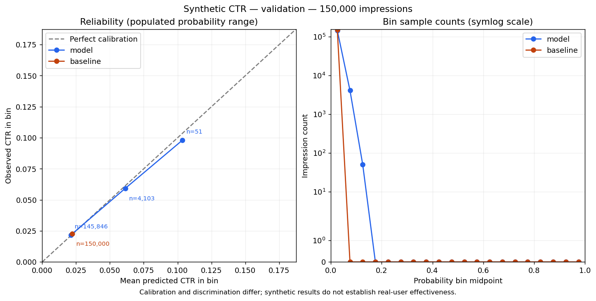
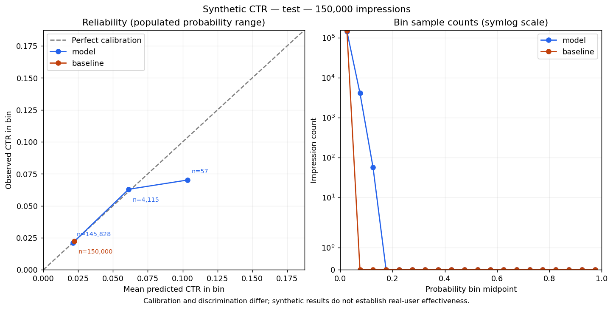

# Frozen CTR probability evaluation

Log loss (primary) and Brier loss score probabilities; lower is better. ROC-AUC measures discrimination; higher is better, and a constant baseline has AUC 0.5 when both classes are present. Reliability diagrams assess calibration with bin counts; lower log loss alone does not prove better calibration. Validation was used for model selection; final test is a later chronological synthetic cohort. These results do not establish real-user effectiveness or generalization to entirely unseen users/ads. No minimum score or lift is required. Do not retune the generator, refit preprocessing or select models after inspecting final-test results.

Model: `1597174fe75a23b1b7c5b0be58ab3ded6a63b542a3ed9408d3247e70bc1d1055`. Training-only base rate: 0.02229429.

| Split | Predictor | Count | Clicks | Observed CTR | Log loss | ROC-AUC | Brier loss |
| --- | --- | ---: | ---: | ---: | ---: | ---: | ---: |
| validation | model | 150000 | 3408 | 0.02272000 | 0.10542357 | 0.63866634 | 0.02204824 |
| validation | baseline | 150000 | 3408 | 0.02272000 | 0.10844812 | 0.50000000 | 0.02220398 |
| test | model | 150000 | 3337 | 0.02224667 | 0.10417316 | 0.62593177 | 0.02162058 |
| test | baseline | 150000 | 3337 | 0.02224667 | 0.10665850 | 0.50000000 | 0.02175175 |

All model/baseline rows are identical within each split. JSON retains full provenance, model settings, split boundaries and empty-bin counts.
